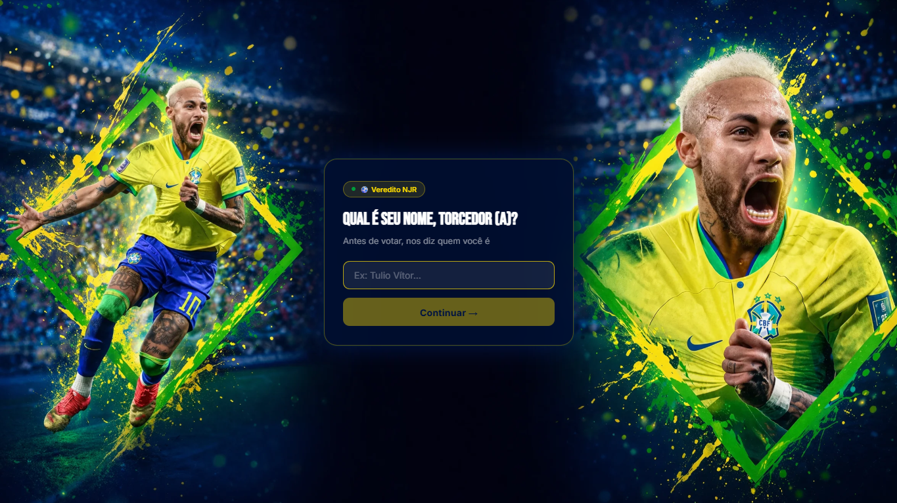
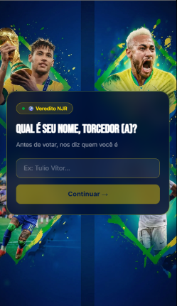

<div align="center">

# ⚽ Veredito NJR

**Uma página de votação em tempo real — levaria o Neymar para a Copa?**



[](https://SEU-USUARIO.github.io/veredito-njr)
[](https://developer.mozilla.org/pt-BR/docs/Web/HTML)
[](https://developer.mozilla.org/pt-BR/docs/Web/CSS)
[](https://developer.mozilla.org/pt-BR/docs/Web/JavaScript)
[](https://supabase.com)

</div>

---

## 📌 Sobre o projeto

O **Veredito NJR** é um projeto de portfólio desenvolvido do zero — da ideia ao deploy — com foco em três áreas que raramente aparecem juntas num primeiro projeto real:

- **UI & UX pensado desde a geração das imagens** de fundo
- **Arquitetura de JavaScript limpo** sem frameworks
- **Banco de dados com realtime** pela primeira vez

O resultado é uma single-page com fluxo de 3 telas, votos salvos no Supabase e atualização ao vivo para todos os usuários simultaneamente.

---

## 🎬 Demonstração

| Desktop | Mobile |
|---|---|
|  |  |

> 💡 *Substitua as imagens acima por screenshots reais do seu projeto*

---

## ✨ Funcionalidades

- **Fluxo de 3 telas** com transições animadas (fade + slide)
- **Nome personalizado** — a pergunta exibe o nome do torcedor
- **Votação com feedback imediato** — barras animam do 0% ao valor real
- **Realtime** — quando outra pessoa vota, as barras atualizam para todos
- **Anti-duplicata** via `localStorage` — sem login, sem fricção
- **Modo offline** — funciona sem banco, contando votos localmente
- **Responsivo** — imagens e layout adaptados para mobile (9:16) e desktop (16:9)

---

## 🧱 Stack

| Tecnologia | Uso |
|---|---|
| HTML5 semântico | Estrutura e fallback estático da tela 1 |
| CSS3 com custom properties | Design system completo, animações e glassmorphism |
| JavaScript vanilla | Toda a lógica, sem frameworks |
| Supabase | Banco de dados PostgreSQL + Realtime via WebSocket |
| Google Fonts | Bebas Neue (display) + Inter (corpo) |

> Nenhuma dependência de frontend. Zero `npm install`. Um único `index.html`.

---

## 🗂️ Estrutura do projeto

```
veredito-njr/
├── index.html          # Estrutura + fallback estático da tela 1
├── styles.css          # Design system completo com CSS variables
├── scripts.js          # Toda a lógica: estado, Supabase, renderização
└── assets/
    ├── bg-desktop.webp # Background 16:9 (gerado com IA)
    └── bg-mobile.webp  # Background 9:16 (gerado com IA)
```

---

## 🧠 Decisões técnicas

### Renderizar primeiro, buscar o banco depois

O maior bug do projeto foi esse. O código original esperava a resposta do Supabase antes de mostrar qualquer coisa — o card ficava vazio por até 3 segundos.

A correção foi simples e definitiva:

```javascript
async function init() {
  // 1. Renderiza IMEDIATAMENTE — sem esperar o banco
  renderScreen1();

  // 2. Busca os dados em background (não bloqueia a UI)
  await fetchCounts();
  renderStats();

  // 3. Liga o canal de tempo real
  subscribeRealtime();
}
```

**Lição:** UX primeiro. Banco em background.

---

### Getter lazy para o Supabase

O cliente só é inicializado quando as credenciais reais estão preenchidas e o CDN já carregou — sem race condition, sem crash silencioso.

```javascript
let _supabaseClient = null;

function getSupabase() {
  if (_supabaseClient) return _supabaseClient;

  if (
    typeof window.supabase !== 'undefined' &&
    SUPABASE_URL !== 'YOUR_SUPABASE_URL' &&
    SUPABASE_ANON_KEY !== 'YOUR_SUPABASE_ANON_KEY'
  ) {
    _supabaseClient = window.supabase.createClient(SUPABASE_URL, SUPABASE_ANON_KEY);
  }

  return _supabaseClient;
}
```

---

### Anti-XSS no nome do usuário

O nome digitado nunca vai direto para `innerHTML`. Sempre via `textContent` ou DOM seguro:

```javascript
const nameSpan = document.createElement('span');
nameSpan.className = 'name-highlight';
nameSpan.textContent = state.userName; // seguro — nunca innerHTML
```

---

### Animação das barras com trigger de 10ms

A transição CSS do `width: 0%` para o valor real só dispara se o elemento já estiver no DOM. O `setTimeout` de 10ms garante o frame de renderização:

```javascript
setTimeout(() => {
  barYes.style.width = `${pct.sim}%`;
  barNo.style.width  = `${pct.nao}%`;
}, 10);
```

---

## 🗄️ Configuração do Supabase

### 1. Criar o projeto

Acesse [supabase.com](https://supabase.com), crie um projeto e vá em **Settings → API** para copiar:
- `Project URL` → `SUPABASE_URL`
- `anon public` → `SUPABASE_ANON_KEY`

### 2. Criar a tabela

Execute no **SQL Editor** do Supabase:

```sql
CREATE TABLE votes (
  id UUID DEFAULT gen_random_uuid() PRIMARY KEY,
  choice TEXT NOT NULL CHECK (choice IN ('sim', 'nao')),
  created_at TIMESTAMPTZ DEFAULT now()
);

ALTER TABLE votes ENABLE ROW LEVEL SECURITY;

CREATE POLICY "Anyone can insert"
  ON votes FOR INSERT WITH CHECK (true);

CREATE POLICY "Anyone can read"
  ON votes FOR SELECT USING (true);

ALTER PUBLICATION supabase_realtime ADD TABLE votes;
```

### 3. Configurar as credenciais

No topo do `scripts.js`:

```javascript
const SUPABASE_URL = 'https://xxxxxxxxxxxx.supabase.co';
const SUPABASE_ANON_KEY = 'eyJhbGciOiJIUzI1NiIsInR5cCI6IkpXVCJ9...';
```

---

## 🚀 Como rodar localmente

```bash
# Clone o repositório
git clone https://github.com/SEU-USUARIO/veredito-njr.git

# Entre na pasta
cd veredito-njr

# Abra com Live Server (VS Code) ou qualquer servidor local
# Não funciona abrindo o index.html diretamente (restrições de CORS)
```

---

## 📈 Processo de desenvolvimento

Este projeto foi documentado em etapas. Cada decisão tem uma razão:

| Etapa | O que foi feito |
|---|---|
| 01 | Definição do conceito e fluxo das 3 telas |
| 02 | Criação dos prompts para as imagens de fundo (16:9 e 9:16) com IA |
| 03 | Prompt de design para o Google Stitch AI |
| 04 | Geração da estrutura base pelo AntiGravity |
| 05 | Diagnóstico e correção dos 5 bugs de renderização |
| 06 | Criação da tabela no Supabase e configuração de RLS |
| 07 | Integração do realtime e testes multi-aba |
| 08 | Ajustes de responsividade mobile |
| 09 | Deploy no GitHub Pages |

---

## 💡 O que eu aprenderia diferente

- Teria começado com o `init()` renderizando a UI antes de qualquer requisição
- Teria testado as credenciais do Supabase logo na primeira integração, não depois
- Teria gerado as imagens mobile (9:16) junto com as desktop desde o início

---

## 👨‍💻 Autor

**TULIO VITOR**

[](https://linkedin.com/in/tuliovitor)
[](https://github.com/tuliovitor)

---

<div align="center">

Feito com muito ☕ e muito ⚽

</div>
